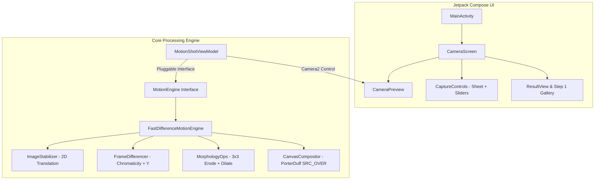

# MotionShot — Action Sequence Stroboscopic Camera

[](https://developer.android.com)
[](https://kotlinlang.org)
[](https://developer.android.com/jetpack/compose)
[](LICENSE)

**MotionShot** is a high-performance Android camera application engineered for stroboscopic action sequence photography (inspired by Sony’s legacy Motion Shot technology). It processes continuous movement into a single composite image, mapping the entire trajectory of moving subjects with zero heavy AI overhead.

---

## Key Features

- **Sony Motion Shot Pipeline**:
  - **Dynamic Frame Interval Math**: Captures $N$ frames strictly within $T$ seconds using `SystemClock` anchor-based scheduling.
  - **Normalized Chromaticity Motion Differencing**: $r, g$ color ratio + BT.601 luminance separation — immune to camera auto-exposure shifts and shadows.
  - **3x3 Morphological Opening**: Sparse $3 \times 3$ Erode + Dilate to eliminate background sensor noise.
  - **1-Pixel Soft Alpha Feathering**: Smooth, anti-aliased subject contours with zero pixelation or stair-step artifacts.
  - **Sequence Alpha Fade (`FadeEffect.FADE_OUT`)**: Progressive transparency decay highlighting the final pose.

- **Pixel-to-Pixel Handheld Image Stabilization**:
  - 2D translation alignment engine (`ImageStabilizer`) cancels out handheld camera micro-shake ($\pm 16\text{px}$ search window) so static background edges lock 100% in place.

- **Manual Hardware Camera Controls**:
  - **Continuous Shutter Speed Slider**: Continuous logarithmic control from `Auto` (1/30s) up to `1/8000s` to freeze fast action.
  - **Continuous ISO Slider**: Continuous control from `Auto` (ISO 0) to `ISO 3200` to auto-balance brightness.

- **Step-by-Step Debug & Raw Inspection Gallery**:
  - Inspect individual raw frame captures in a horizontal thumbnail strip (`#1` ... `#N`) before compositing.

- **Pluggable Engine Architecture**:
  - Decoupled `MotionEngine` interface and `MotionEngineFactory` for plugging in custom AI segmentation models or OpenCV algorithms.

---

## Architecture Overview



---

## Project Structure

```text
bted.app.motionshot/
├── capture/
│   ├── FrameAnalyzer.kt       # CameraX ImageAnalysis analyzer
│   └── YuvToRgb.kt            # Native C++ accelerated ImageProxy to Bitmap
├── engine/
│   ├── MotionEngine.kt        # Pluggable engine interface contract
│   ├── FastDifferenceMotionEngine.kt  # Math & Differencing engine
│   ├── MotionEngineFactory.kt # Engine registry & factory
│   └── DebugPipelineConfig.kt # Step-by-step pipeline config
├── processing/
│   ├── FrameDifferencer.kt    # Normalized chromaticity & luminance differencer
│   ├── ImageStabilizer.kt     # Pixel-to-pixel 2D handheld stabilizer
│   ├── MorphologyOps.kt       # 3x3 Erode, Dilate, and Morphological Opening
│   └── CanvasCompositor.kt    # Native Canvas PorterDuff compositing
├── ui/
│   ├── components/
│   │   ├── CaptureControls.kt # Sliders, custom input, tap-to-record button
│   │   └── LoadingOverlay.kt  # Pulsing progress overlay
│   ├── state/
│   │   ├── MotionShotUiState.kt # UI state holder & CameraParameterUtils
│   │   └── CapturePhase.kt    # Capture phase lifecycle
│   ├── theme/                 # Dark aesthetic color, typography, theme
│   ├── CameraPreview.kt       # CameraX preview + Camera2Interop hardware controls
│   └── CameraScreen.kt        # Root camera & result gallery screen
└── viewmodel/
    └── MotionShotViewModel.kt # StateFlow, capture loop, engine dispatcher
```

---

## Getting Started & Building

### Requirements
- **Android Studio**: Ladybug / Jellyfish or newer
- **Android SDK**: Compile SDK 37 (Min SDK 24)
- **Kotlin**: 2.2.10
- **Gradle**: 8.13+

### Build from Command Line

```bash
# Clone the repository
git clone https://github.com/your-username/MotionShot.git
cd MotionShot

# Build Debug APK
./gradlew assembleDebug
```

The output APK will be located at `app/build/outputs/apk/debug/app-debug.apk`.

---

## License

This project is licensed under the **MIT License** — see the [LICENSE](LICENSE) file for details.
