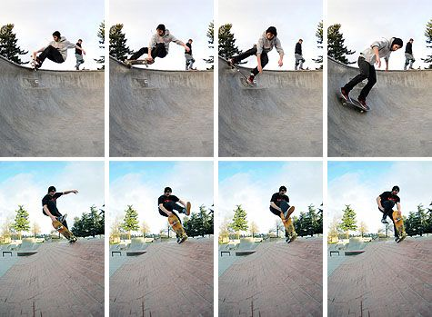
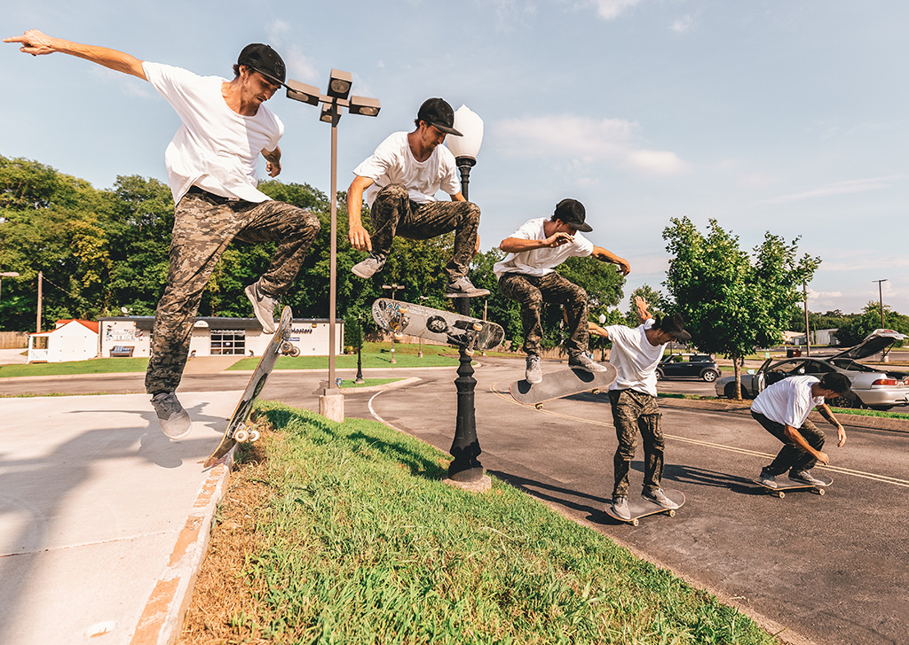
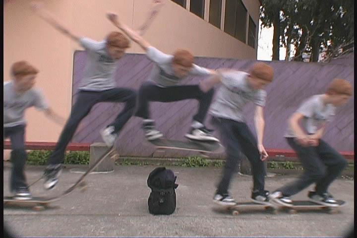
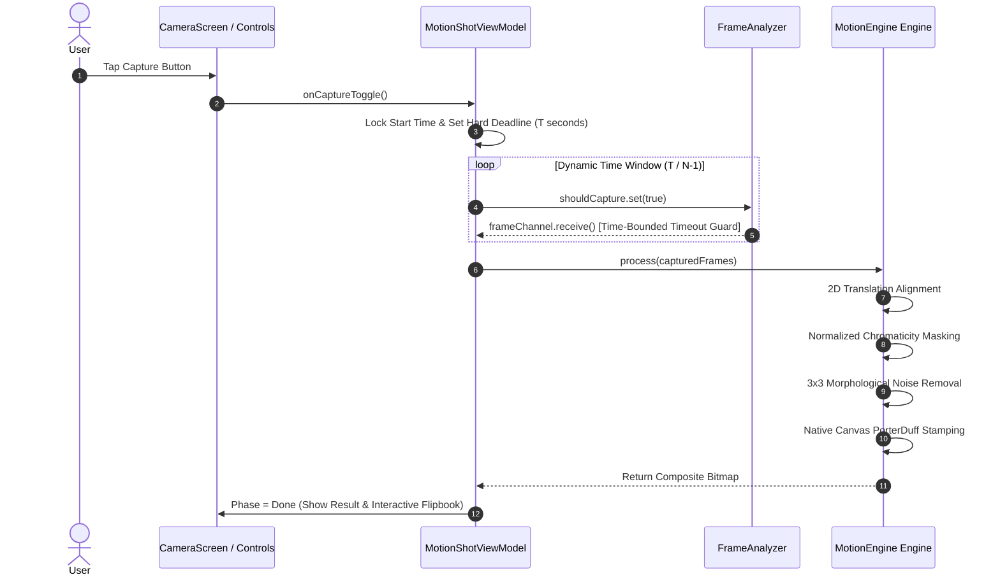

<div align="center">
  

  <br />
  <br />

  <h1>MotionShot</h1>
  <p><b>High-Performance Stroboscopic Action Sequence Camera for Android</b></p>

  <p>
    <a href="https://github.com/AhmadHassan-BTed/MotionShot"></a>
    
    
    
    
  </p>

  <p><i>Engineered and maintained by <b>Ahmad Hassan (B-Ted)</b></i></p>
</div>

<br />

## Overview & Vision

Human movement is inherently transient. Whether an athlete sprinting, a dancer executing a spin, a gymnast mid-air, or a child jumping, fleeting physical motion unfolds and vanishes within fractions of a second.

**MotionShot** bridges high-speed mobile computer vision with human kinetic expression. Inspired by Sony's legacy Motion Shot technology, MotionShot captures dynamic action bursts and synthesizes a single, multi-pose stroboscopic composite image directly on-device in real time.

Operating entirely offline with zero cloud latency and zero reliance on heavy AI neural networks, MotionShot renders motion as an aligned visual trajectory—sharp, stabilized, and captured in full sensor resolution.

<br />

## Visual Showcase

<div align="center">

| Camera Viewfinder | Hardware Sliders | Step 1 Raw Gallery | Composite Result |
| :---: | :---: | :---: | :---: |
|  |  |  |  |

</div>

<br />

## Technical Specifications

| Parameter | Specification & Range | Engineering Function |
| :--- | :--- | :--- |
| **Timer Window** | `1s`, `2s`, `5s`, `Custom (1–60s)` | Dynamic sequence capture deadline |
| **Frame Count** | `5`, `15`, `25`, `Custom (2–50)` | Trajectory density sampling points |
| **Shutter Speed** | `Auto`, `1/30s` to `1/8000s` | Logarithmic hardware motion-freeze slider |
| **ISO Sensitivity** | `Auto`, `ISO 50` to `ISO 102,400` | Continuous sensor gain boost |
| **Stabilization** | $\pm 16\text{px}$ 2D translation search | Sub-5ms background micro-jitter alignment |
| **Blending Engine** | `PorterDuff.Mode.SRC_OVER` | Sequential alpha layer compositing |
| **Persistence** | `SharedPreferences` | Automatic parameter restoration across sessions |

<br />

## Key Features

- **Pixel-to-Pixel Handheld Image Stabilization**: The 2D translation alignment engine (`ImageStabilizer`) correlates background grid pixels across frames, locking static elements in place to eliminate camera shake.
- **Normalized Chromaticity Motion Differencing**: Evaluates $r, g$ color space ratios alongside BT.601 luminance separation, making motion detection 100% immune to camera exposure shifts and shadows.
- **High Shutter Speed Freeze-Frame Control**: Manual shutter speed control down to `1/8000s` ($125\,\mu\text{s}$ exposure) freezes ultra-fast movement without motion blur.
- **Extended ISO Gain Boost**: Manual ISO control scaling up to **ISO 102,400** maintains crisp image brightness even under high shutter speeds in low light.
- **Fast Motion Slide & Auto-Play Flipbook Preview**: Interactive touch-drag preview and a `▶ Play` button (15 FPS flipbook) allow instant sequence verification before finalizing.
- **Pluggable Engine Architecture**: Decoupled `MotionEngine` interface and `MotionEngineFactory` allow instant engine swapping without modifying UI state logic.

<br />

## Architecture Overview

MotionShot follows a strict **Contract-Based Clean Architecture**, decoupling UI presentation, state orchestration, image processing algorithms, and Camera2 hardware controls.

```mermaid
graph TD
    classDef ui fill:#1b3233,stroke:#5cdec8,stroke-width:1.5px,color:#eae6f0;
    classDef domain fill:#1e2638,stroke:#b088f0,stroke-width:1.5px,color:#eae6f0;
    classDef engine fill:#2e2a3a,stroke:#d4af6e,stroke-width:1.5px,color:#eae6f0;
    classDef hw fill:#2a1e28,stroke:#ff8c00,stroke-width:1.5px,color:#eae6f0;

    subgraph Presentation["Presentation Layer (Jetpack Compose)"]
        MA[MainActivity] ::: ui --> CS[CameraScreen] ::: ui
        CS --> CP[CameraPreview Viewfinder] ::: ui
        CS --> CC[CaptureControls Sheet & Sliders] ::: ui
        CS --> RV[Step1ResultView Flipbook Gallery] ::: ui
    end

    subgraph Domain["Domain Contracts & Storage"]
        VM[MotionShotViewModel] ::: domain --> |Preferences| PR[PreferencesRepository] ::: domain
        VM --> |Pluggable Contract| ME[MotionEngine Interface] ::: domain
    end

    subgraph Engine["Image Processing Realizations"]
        ME --> FDEM[FastDifferenceMotionEngine] ::: engine
        FDEM --> STAB[ImageStabilizer Engine] ::: engine
        FDEM --> DIFF[FrameDifferencer Engine] ::: engine
        FDEM --> MORPH[MorphologyOps Engine] ::: engine
        FDEM --> CCMP[CanvasCompositor Engine] ::: engine
    end

    subgraph Hardware["Hardware Capture Layer (CameraX / Camera2)"]
        VM --> FA[FrameAnalyzer] ::: hw
        FA --> YR[Native C++ YuvToRgb] ::: hw
        VM --> C2[Camera2Interop Control] ::: hw
        C2 --> CP
    end
```

<br />

## Technical Processing Pipeline

Each captured frame sequence moves through a zero-allocation processing pipeline:

```mermaid
flowchart TD
    classDef step fill:#1e2638,stroke:#b088f0,stroke-width:1.5px,color:#eae6f0;
    
    A["Raw Frame Burst (N Frames)"] ::: step --> B["1. 2D Translation Alignment (ImageStabilizer)"] ::: step
    B --> C["2. Normalized Chromaticity Differencing (FrameDifferencer)"] ::: step
    C --> D["3. 3x3 Morphological Opening (MorphologyOps)"] ::: step
    D --> E["4. Soft Contour Edge Feathering"] ::: step
    E --> F["5. Sequence Alpha Decay (CanvasCompositor)"] ::: step
    F --> G["Final Stroboscopic Composite Image"] ::: step
```

<br />

## Request Lifecycle & Frame Acquisition



<br />

## Technical Deep-Dives

<details>
<summary><b>1. Handheld 2D Translation Alignment Mathematics</b></summary>

<br />

Camera micro-jitter causes static background edges to shift between frames. MotionShot computes an optimal $(\Delta x, \Delta y)$ alignment vector over a $\pm 16\text{px}$ search window using a 4x grid subsampling strategy:

$$\Delta x, \Delta y = \arg\min_{dx, dy} \sum_{y, x} \left| \text{Base}(x, y) - \text{Curr}(x + dx, y + dy) \right|$$

Target frame pixels are shifted by $(\Delta x, \Delta y)$ prior to motion differencing, locking static background elements 100% in place.

</details>

<details>
<summary><b>2. Normalized Chromaticity Color Space (r, g)</b></summary>

<br />

Camera auto-exposure shifts brightness across frames. Simple RGB subtraction fails under exposure drift. MotionShot converts pixels to **Normalized Chromaticity**:

$$r = \frac{R}{R + G + B + 1}, \quad g = \frac{G}{R + G + B + 1}$$

Combining chromaticity distance $\Delta_{\text{chroma}} = |r_1 - r_0| + |g_1 - g_0|$ with BT.601 luminance separation ($\Delta_Y = |Y_1 - Y_0|$) ensures lighting fluctuations and shadows are 100% ignored.

</details>

<details>
<summary><b>3. Camera2 Hardware Exposure & ISO Interop</b></summary>

<br />

High shutter speeds (1/500s to 1/8000s) eliminate subject motion blur. CameraX parameters are applied directly to the Camera2 HAL via `Camera2CameraControl`:

- `CaptureRequest.CONTROL_AE_MODE`: Set to `OFF` for manual exposure control.
- `CaptureRequest.SENSOR_EXPOSURE_TIME`: Configured in nanoseconds via logarithmic slider.
- `CaptureRequest.SENSOR_SENSITIVITY`: Configured up to ISO 102,400 for low-light gain compensation.

</details>

<br />

## Repository Structure

```text
bted.app.motionshot/
├── capture/
│   ├── FrameAnalyzer.kt       # CameraX ImageAnalysis analyzer
│   └── YuvToRgb.kt            # Native C++ accelerated ImageProxy to Bitmap
├── data/
│   └── PreferencesRepository.kt # SharedPreferences persistence (Timer, Count, Shutter, ISO)
├── engine/
│   ├── MotionEngine.kt        # Pluggable engine interface contract
│   ├── FastDifferenceMotionEngine.kt  # Math & Differencing engine
│   ├── MotionEngineFactory.kt # Engine registry & factory
│   └── DebugPipelineConfig.kt # Step-by-step pipeline config
├── processing/
│   ├── FrameDifferencer.kt    # Normalized chromaticity & luminance differencer
│   ├── ImageStabilizer.kt     # Pixel-to-pixel 2D handheld stabilizer
│   ├── MorphologyOps.kt       # 3x3 Erode, Dilate, and Morphological Opening
│   └── CanvasCompositor.kt    # Native Canvas PorterDuff compositing
├── ui/
│   ├── components/
│   │   ├── CaptureControls.kt # Sliders, custom input, tap-to-record button
│   │   └── LoadingOverlay.kt  # Pulsing progress overlay
│   ├── state/
│   │   ├── MotionShotUiState.kt # UI state holder & CameraParameterUtils
│   │   └── CapturePhase.kt    # Capture phase lifecycle
│   ├── theme/                 # Dark aesthetic color, typography, theme
│   ├── CameraPreview.kt       # CameraX preview + Camera2Interop hardware controls
│   └── CameraScreen.kt        # Root camera & result flipbook gallery screen
└── viewmodel/
    └── MotionShotViewModel.kt # StateFlow, preferences, capture loop, engine dispatcher
```

<br />

## Building & Requirements

### System Requirements
- **Android Studio**: Ladybug / Jellyfish or newer
- **Android SDK**: Compile SDK 37 (Min SDK 24)
- **Kotlin**: 2.2.10
- **Gradle**: 8.13+

### Local Build Commands

```bash
# Clone the repository
git clone https://github.com/AhmadHassan-BTed/MotionShot.git
cd MotionShot

# Execute unit tests
./gradlew test

# Build Debug APK
./gradlew assembleDebug
```

<br />

<div align="center">
  <p><i>Engineered and maintained by <b>Ahmad Hassan (B-Ted)</b></i></p>
</div>
