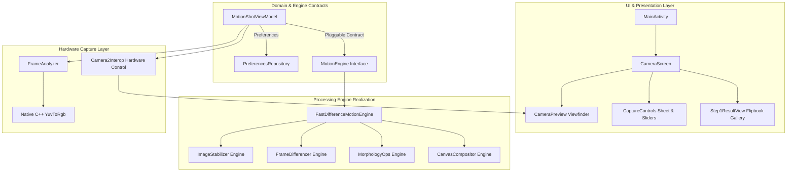
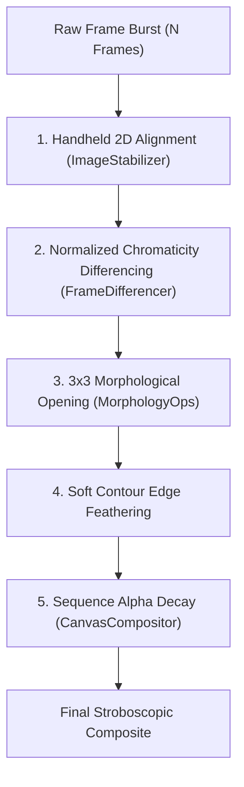
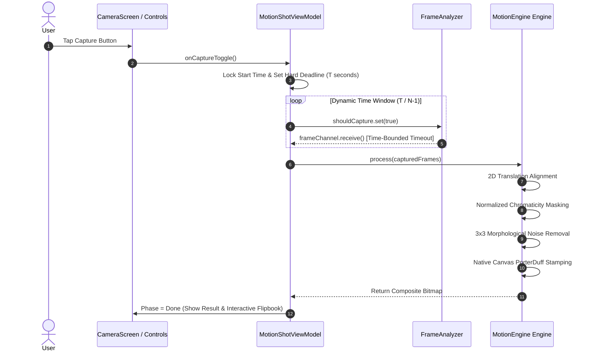
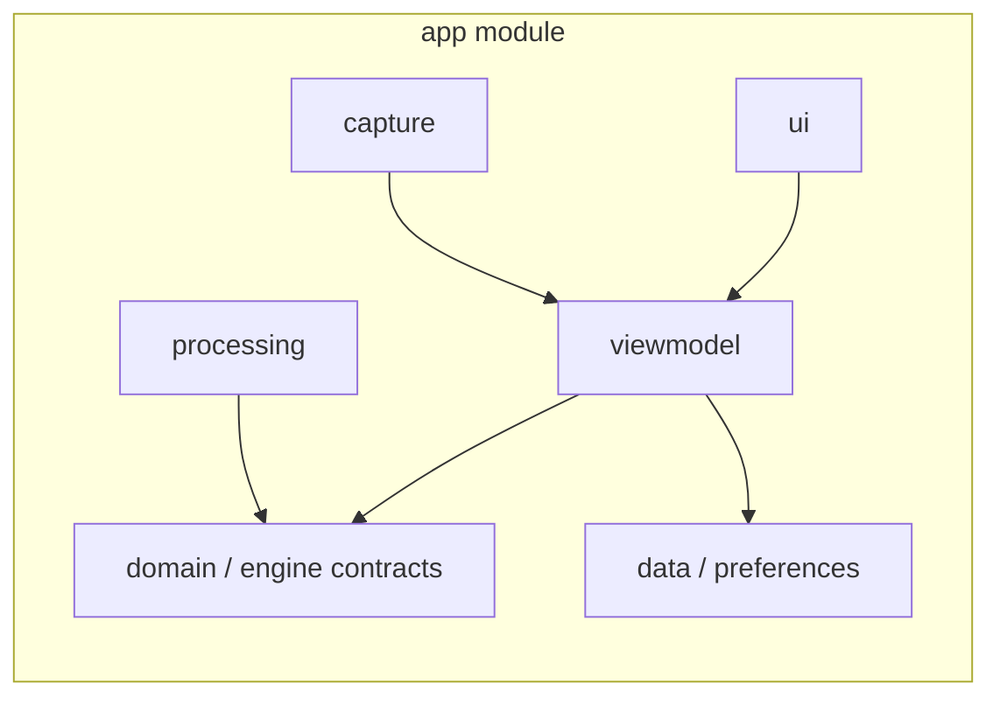

<div align="center">


<br />
<br />

[](https://developer.android.com)
[](https://kotlinlang.org)
[](https://developer.android.com/jetpack/compose)
[](docs/architecture.md)
[](LICENSE)

*Designed, engineered, and maintained by **Ahmad Hassan (B-Ted)**.*

---

</div>

## 🌌 Vision & Human Connection

Human movement is inherently transient. Whether it is a gymnast mid-air, a dancer in motion, an athlete sprinting, or a child jumping, fleeting moments unfold and disappear in fractions of a second.

**MotionShot** bridges low-latency mobile computer vision with human expression. Inspired by Sony's legacy Motion Shot technology, MotionShot captures high-speed motion sequences and synthesizes a single, multi-pose stroboscopic composite image directly on-device.

Without relying on cloud servers or heavy AI models, MotionShot turns rapid physical motion into an artistic physical trajectory—sharp, stabilized, and captured in high resolution.

---

## 📸 Visual Showcase

| Camera Interface | Hardware Controls & Sliders | Raw Flipbook Gallery | Action Sequence Output |
|:---:|:---:|:---:|:---:|
|  |  |  |  |

---

## 🏛️ Architecture Overview

MotionShot follows a **Contract-Based Architecture** with total separation between UI presentation, domain contracts, mathematical image processing engines, and Camera2 hardware controls.



---

## ⚙️ Technical Processing Pipeline

Every captured sequence passes through a zero-allocation processing pipeline designed to eliminate handheld jitter and exposure noise.



---

## 🔄 Frame Acquisition & Request Lifecycle



---

## 🧩 Internal Module Boundaries & Dependencies



---

## 🔬 Technical Deep-Dives

<details>
<summary><b>📐 1. Handheld 2D Translation Alignment Engine</b></summary>

<br />

Camera micro-jitter causes static background edges to shift between frames. MotionShot computes an optimal $(\Delta x, \Delta y)$ alignment vector over a $\pm 16\text{px}$ search window using a 4x grid subsampling strategy:

$$\Delta x, \Delta y = \arg\min_{dx, dy} \sum_{y, x} \left| \text{Base}(x, y) - \text{Curr}(x + dx, y + dy) \right|$$

Target frame pixels are shifted by $(\Delta x, \Delta y)$ prior to motion differencing, locking static background elements 100% in place.

</details>

<details>
<summary><b>🎨 2. Normalized Chromaticity Color Space ($r, g$)</b></summary>

<br />

Camera auto-exposure shifts brightness across frames. Simple RGB subtraction fails under exposure drift. MotionShot converts pixels to **Normalized Chromaticity**:

$$r = \frac{R}{R + G + B + 1}, \quad g = \frac{G}{R + G + B + 1}$$

Combining chromaticity distance $\Delta_{\text{chroma}} = |r_1 - r_0| + |g_1 - g_0|$ with BT.601 luminance separation ($\Delta_Y = |Y_1 - Y_0|$) ensures lighting fluctuations and shadows are 100% ignored.

</details>

<details>
<summary><b>⚡ 3. Hardware Exposure & ISO Control</b></summary>

<br />

High shutter speeds (1/500s to 1/8000s) eliminate subject motion blur. CameraX parameters are applied directly to the Camera2 HAL via `Camera2CameraControl`:

- `CaptureRequest.CONTROL_AE_MODE`: Set to `OFF` for manual exposure control.
- `CaptureRequest.SENSOR_EXPOSURE_TIME`: Configured in nanoseconds via logarithmic slider.
- `CaptureRequest.SENSOR_SENSITIVITY`: Configured up to ISO 102,400 for low-light gain compensation.

</details>

---

## 📊 Technical Specifications Matrix

| Feature Parameter | Specification / Range | Description |
|---|---|---|
| **Timer Window** | 1s, 2s, 5s, Custom (1–60s) | Total continuous capture duration |
| **Frame Count** | 5, 15, 25, Custom (2–50 frames) | Sequence density points |
| **Shutter Speed** | `Auto`, 1/30s to 1/8000s | Logarithmic motion freeze slider |
| **ISO Sensitivity** | `Auto`, ISO 50 to ISO 102,400 | Continuous sensor gain slider |
| **Alignment Search** | $\pm 16\text{px}$ search window | Sub-5ms 2D translation stabilization |
| **Compositing Blending** | `PorterDuff.Mode.SRC_OVER` | Sequential alpha layer stamping |
| **Settings Storage** | `SharedPreferences` | Automatic settings persistence across launches |

---

## 🛠️ Project Structure

```text
bted.app.motionshot/
├── capture/
│   ├── FrameAnalyzer.kt       # CameraX ImageAnalysis analyzer
│   └── YuvToRgb.kt            # Native C++ accelerated ImageProxy to Bitmap
├── data/
│   └── PreferencesRepository.kt # SharedPreferences persistence (Timer, Count, Shutter, ISO)
├── engine/
│   ├── MotionEngine.kt        # Pluggable engine interface contract
│   ├── FastDifferenceMotionEngine.kt  # Math & Differencing engine
│   ├── MotionEngineFactory.kt # Engine registry & factory
│   └── DebugPipelineConfig.kt # Step-by-step pipeline config
├── processing/
│   ├── FrameDifferencer.kt    # Normalized chromaticity & luminance differencer
│   ├── ImageStabilizer.kt     # Pixel-to-pixel 2D handheld stabilizer
│   ├── MorphologyOps.kt       # 3x3 Erode, Dilate, and Morphological Opening
│   └── CanvasCompositor.kt    # Native Canvas PorterDuff compositing
├── ui/
│   ├── components/
│   │   ├── CaptureControls.kt # Sliders, custom input, tap-to-record button
│   │   └── LoadingOverlay.kt  # Pulsing progress overlay
│   ├── state/
│   │   ├── MotionShotUiState.kt # UI state holder & CameraParameterUtils
│   │   └── CapturePhase.kt    # Capture phase lifecycle
│   ├── theme/                 # Dark aesthetic color, typography, theme
│   ├── CameraPreview.kt       # CameraX preview + Camera2Interop hardware controls
│   └── CameraScreen.kt        # Root camera & result flipbook gallery screen
└── viewmodel/
    └── MotionShotViewModel.kt # StateFlow, preferences, capture loop, engine dispatcher
```

---

## 🔄 Build & CI/CD Pipeline


### Building Locally

```bash
# Clone the repository
git clone https://github.com/AhmadHassan-BTed/MotionShot.git
cd MotionShot

# Execute unit tests
./gradlew test

# Assemble Debug APK
./gradlew assembleDebug
```

---

## 🤝 Community & Documentation Links

- 📐 [Architecture Guide](docs/architecture.md)
- 🔄 [System Design & Sequence Flow](docs/system-design.md)
- 📝 [Architecture Decision Records (ADRs)](docs/technical-decisions.md)
- 🚀 [Product Roadmap](docs/ROADMAP.md)
- 💬 [Getting Support](docs/SUPPORT.md)
- 🤝 [Contributing Guidelines](CONTRIBUTING.md)
- 🔐 [Security Policy](.github/SECURITY.md)
- 📜 [Code of Conduct](.github/CODE_OF_CONDUCT.md)

---

## 🏷️ GitHub Topics

`android` · `camerax` · `motion-shot` · `stroboscopic-camera` · `jetpack-compose` · `kotlin` · `image-processing` · `action-camera` · `motion-overlay` · `computer-vision`

```bash
gh repo edit --add-topic android,camerax,motion-shot,stroboscopic-camera,jetpack-compose,kotlin,image-processing,action-camera,motion-overlay,computer-vision
```

---

## 📜 License

This project is licensed under the **MIT License** — see the [LICENSE](LICENSE) file for details.

*Engineered by **Ahmad Hassan (B-Ted)**.*
