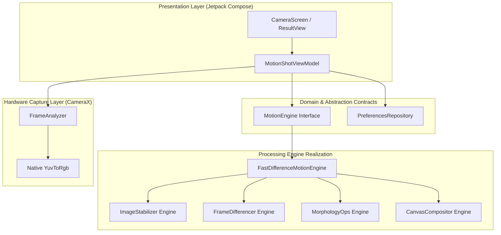

# Architecture Documentation

## Overview

MotionShot is engineered using a **High-Cohesion, Low-Coupling Contract-Based Architecture**. Each layer operates behind explicit interfaces to promote modularity, testability, and enterprise-grade maintainability.

Maintainer: **Ahmad Hassan (B-Ted)**

---

## Architectural Layers



---

## Layer Responsibilities

### 1. Presentation Layer (`bted.app.motionshot.ui`)
- **Jetpack Compose UI**: Declarative UI components (`CaptureControls`, `CameraPreview`, `Step1ResultView`).
- **MVI / ViewModel State**: `MotionShotViewModel` exposes state via `StateFlow<MotionShotUiState>`.
- **View Modes**: Supports `RAW_FRAME_GALLERY` (Step 1 Inspection) and `COMPOSITE`.

### 2. Domain & Engine Contracts (`bted.app.motionshot.engine`)
- **`MotionEngine` Interface**:
  ```kotlin
  interface MotionEngine {
      suspend fun process(frames: List<Bitmap>, config: EngineConfig = EngineConfig()): Bitmap
  }
  ```
- **`MotionEngineFactory`**: Registry allowing instant substitution of motion engines (e.g. math differencer vs AI MediaPipe segmentation).

### 3. Image Processing Realizations (`bted.app.motionshot.processing`)
- **`ImageStabilizer`**: Computes $(\Delta x, \Delta y)$ translation vectors using fast 4x downsampled grid correlation to cancel handheld camera shake ($\pm 16\text{px}$ search window).
- **`FrameDifferencer`**: Normalized Chromaticity ($r, g$) + BT.601 Luminance separation to ignore exposure shifts.
- **`MorphologyOps`**: $3 \times 3$ Erode + Dilate forward propagation.
- **`CanvasCompositor`**: Native Android `Canvas` + `Paint(PorterDuff.Mode.SRC_OVER)` with 1-pixel contour edge feathering.

---

## Memory & Performance Management

1. **Zero-Allocation Processing**: IntArray pixel buffers (`rawMask`, `tempMask`, `cleanMask`, `alignedPixels`) are allocated **ONCE** per compositing pass and reused across frame iterations.
2. **Explicit Bitmap Recycling**: Intermediate overlay bitmaps are recycled using `bitmap.recycle()` immediately post-stamping to guarantee zero heap memory leaks or OOM crashes.
3. **C++ Native Camera Conversion**: `YuvToRgb.convert()` leverages native C++ `ImageProxy.toBitmap()` to reduce frame acquisition latency to $\approx 5\text{ms}$.
