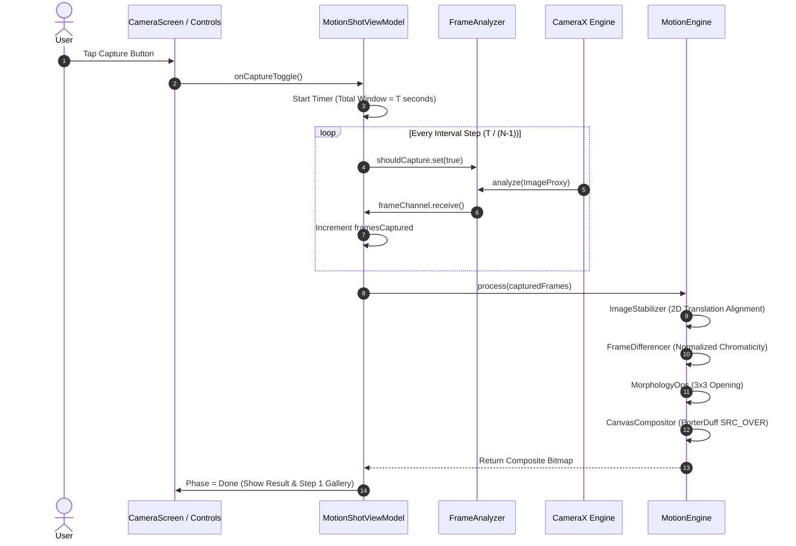

# System Design & Frame Lifecycle

Maintainer: **Ahmad Hassan (B-Ted)**

---

## Frame Acquisition & Scheduling Lifecycle



---

## Handheld 2D Translation Alignment

Camera micro-jitter is cancelled via translation vector estimation:

$$\Delta x, \Delta y = \arg\min_{dx, dy} \sum_{y, x} |\text{Base}(x, y) - \text{Curr}(x + dx, y + dy)|$$

```mermaid
flowchart LR
    A[Base Frame 0] --> C[ImageStabilizer Correlation Engine]
    B[Target Frame N] --> C
    C -->|Translation Offset (dx, dy)| D[Buffer Alignment & Shift]
    D --> E[Normalized Chromaticity Differencer]
    E --> F[3x3 Morphological Opening]
    F --> G[Native Canvas PorterDuff Stamping]
```
